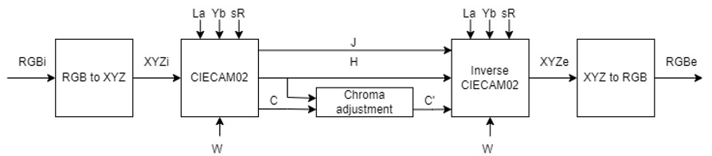

# Chroma Contrast Enhancement

This project explores **chroma contrast enhancement** for improving image visibility and preserving structural information under low-contrast or uneven illumination conditions.

The main idea is to perform contrast enhancement in the **CIECAM02 color appearance model**, where chroma can be adjusted more perceptually than in standard RGB-based enhancement methods.

Detailed methodology, experiments, and analysis are available in:

- [Project Report](./DIP%20Final%20Project.pdf)
- [Project Slides](./DIP%20Final%20Project%20Slides.pdf)

## Motivation

Image quality plays an important role in downstream vision tasks such as **image segmentation, object detection, and feature extraction**.  
However, real-world images often suffer from:

- uneven illumination
- low contrast
- blurred edges
- loss of texture details

These issues can reduce the reliability of subsequent image analysis.  
To address this problem, this project investigates **chroma contrast enhancement** using the **CIECAM02 model** to improve foreground-background distinction while preserving the original lighting structure.

## Proposed Method Overview

## Compared Methods

The project compares the proposed method with several baseline enhancement strategies:

1. **Direct Method**  
2. **YCbCr-based Method**  
3. **HSV-based Method**  
4. **Proposed Method**  

## Experiments

- **Number of test images**: 30
- **Evaluation metrics**:
  - PSNR
  - SSIM

The experiments show that the proposed method enhances chroma contrast more effectively while preserving image structure better than the compared methods.

### Qualitative results

### Quantitative Results

| Method | Average PSNR | Average SSIM |
|--------|-------------:|-------------:|
| Proposed | 75.8462 | 0.8571 |
| Direct | 66.9693 | 0.7703 |
| YCbCr | 67.3967 | 0.7787 |
| HSV | 68.1406 | 0.8473 |

## Results Summary

The proposed method achieves the best performance among the compared methods in both:

- **PSNR**, indicating better overall reconstruction quality
- **SSIM**, indicating better preservation of structural information

Qualitative comparisons also show that the proposed approach produces stronger chroma contrast enhancement while maintaining the original lighting composition more naturally.

## Authors

- **何景盛** (r13942143)
- **許定楷** (r13942132)